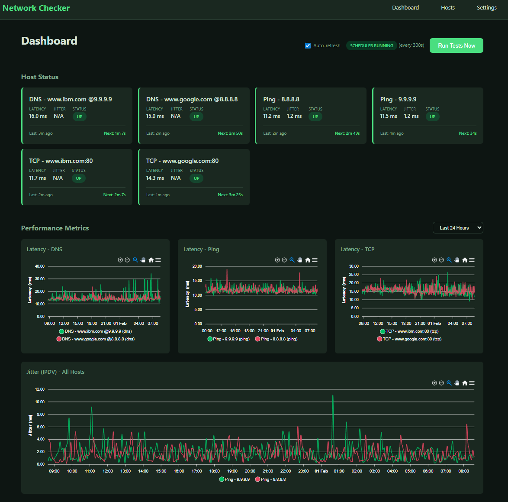

# Network Checker

A lightweight, self-hosted network monitoring application for tracking the availability and performance of hosts across your infrastructure.

Coded 90% by Claude Code. Reduced the time required from 3 weeks (I hardly ever do web apps) to 3 hours. The prompt I used to get started is in the ./docs directory. Use the CLAUDE.md file to make changes using Claude Code.

## Features

- **Multiple Test Types**
  - **Ping (ICMP)** - Single ICMP echo request for latency measurement
  - **TCP** - Port connectivity checks with response time
  - **HTTP/HTTPS** - Web endpoint monitoring with status code validation
  - **DNS** - DNS resolution testing with custom query support
  - **Jitter (Optional)** - 5 ICMP pings for network stability measurement (IPDV)

- **Performance Metrics**
  - Latency tracking (min, max, average)
  - Jitter calculation using IPDV (Inter-Packet Delay Variation) per RFC 3393
  - Uptime percentage calculations
  - Historical data with configurable retention

- **Dashboard**
  - Real-time host status overview
  - Interactive latency and jitter charts (per host and grouped by test type)
  - Reachability heatmaps
  - Configurable time ranges (1 hour to 30 days)
  - Custom date range selection

- **Customization**
  - 12 built-in themes (6 dark, 6 light)
  - Configurable test intervals
  - Adjustable data retention periods
  - Per-host enable/disable controls




## Quick Start

### Docker (Recommended)

```bash
# Clone the repository
git clone https://github.com/fatcat/checker.git
cd checker

# Start with Docker Compose
docker compose up -d

# View logs
docker compose logs -f
```

The application will be available at `http://localhost:9292`

### Docker Run (Alternative)

```bash
# Build the image
docker build -t network-checker .

# Run the container
docker run -d \
  --name network-checker \
  --cap-add NET_RAW \
  -p 9292:9292 \
  -v checker-data:/data \
  network-checker
```

## Configuration

### Environment Variables

| Variable | Default | Description |
|----------|---------|-------------|
| `RACK_ENV` | `production` | Application environment |
| `DATABASE_PATH` | `/data/db/checker.sqlite3` | SQLite database location |
| `LOG_DIR` | `/data/log` | Log file directory |
| `TZ` | `UTC` | Container timezone |
| `DISABLE_SCHEDULER` | (unset) | Set to disable automatic testing |
| `SKIP_MIGRATIONS` | (unset) | Set to skip database migrations |

### Application Settings

Settings can be configured through the web UI at `/settings`:

| Setting | Default | Description |
|---------|---------|-------------|
| Test Interval | 300s (5 min) | Time between automated tests |
| Raw Data Retention | 14 days | How long to keep individual measurements before aggregating to 15-minute intervals |
| 15-Min Aggregation Retention | 30 days | How long to keep 15-minute aggregates before converting to hourly |
| HTTP Timeout | 10s | Timeout for HTTP/HTTPS tests |
| TCP Timeout | 5s | Timeout for TCP connection tests |
| DNS Timeout | 5s | Timeout for DNS resolution tests |
| Ping Count | 5 | Number of pings for jitter calculation (when jitter is enabled) |
| Ping Timeout | 5s | Timeout per ping packet (used by both ping and jitter tests) |
| Log Rotation | hourly | How often to rotate log files (hourly or daily) |
| Log Retention | 12 files | Number of log files to keep |
| Theme | dark-default | UI color scheme |

**Data Lifecycle:**
- Raw measurements are kept for the configured retention period, then aggregated to 15-minute intervals
- 15-minute aggregates are kept for the configured retention period, then aggregated to hourly intervals
- Hourly aggregates are retained for a maximum of **1 year**
- Database size with 10 tests running continuously: approximately **50 MB** after one year of operation

## Adding Hosts

1. Navigate to **Hosts** in the navigation bar
2. Click **Add Host**
3. Fill in the host details:
   - **Name**: Display name for the host
   - **Address**: IP address or hostname
   - **Test Timing Variability**: Percentage variation in test timing (0-50%)
   - **Perform jitter calculation** (optional): Enable IPDV jitter measurement
4. Configure latency tests for the host:
   - **Ping (ICMP) Latency**: Single ICMP ping for latency measurement
   - **TCP**: Port connectivity (requires port number)
   - **HTTP**: Web endpoint (requires port and scheme http/https)
   - **DNS**: DNS resolution (requires hostname to resolve)
5. Click **Save & Test** to validate configuration
6. Click **Continue** to return to the hosts list

## Architecture

```
checker/
├── app/
│   ├── models/          # Sequel ORM models
│   ├── routes/          # API endpoints
│   └── views/           # ERB templates
├── bin/                 # Executable scripts
│   ├── console          # Interactive console
│   ├── setup            # Project setup
│   ├── server           # Start server
│   └── test             # Run tests
├── config/
│   ├── application.rb   # App configuration
│   └── database.rb      # Database setup
├── db/
│   └── migrations/      # Database migrations
├── lib/
│   ├── checker/
│   │   ├── testers/     # Test type implementations
│   │   ├── aggregator.rb    # Data aggregation
│   │   ├── logger.rb        # Rotating log handler
│   │   ├── scheduler.rb     # Background test scheduler
│   │   ├── theme_loader.rb  # Theme management
│   │   └── version.rb       # Version constant
│   └── tasks/           # Rake tasks
├── test/                # Minitest test suite
│   ├── models/          # Model tests
│   ├── lib/             # Library tests
│   ├── integration/     # Integration tests
│   └── test_helper.rb   # Test configuration
├── public/              # Static assets (CSS, JS)
├── themes/              # Theme definitions (YAML)
├── config.ru            # Rack configuration
├── Dockerfile
└── docker-compose.yaml
```

## API Endpoints

### Hosts
- `GET /api/hosts` - List all hosts
- `GET /api/hosts/:id` - Get host details
- `POST /api/hosts` - Create a new host
- `PUT /api/hosts/:id` - Update a host
- `DELETE /api/hosts/:id` - Delete a host
- `GET /api/hosts/status` - Get current status of all hosts

### Measurements
- `GET /api/measurements/host/:id` - Get measurements for a host
- `GET /api/measurements/latency` - Get latency series for all hosts
- `GET /api/measurements/latency/by-type` - Get latency grouped by test type
- `GET /api/measurements/jitter` - Get jitter series for all hosts

### Tests
- `POST /api/tests/run/:id` - Run an immediate test for a host
- `POST /api/tests/run-all` - Run tests for all enabled hosts

### Settings
- `GET /api/settings` - Get all settings
- `PUT /api/settings` - Update settings

### System
- `GET /health` - Health check endpoint

## Data Persistence

When running with Docker, all data is stored in the `/data` volume:

- `/data/db/checker.sqlite3` - SQLite database with hosts, measurements, and settings
- `/data/log/checker.log.*` - Rotating application logs

To backup your data:

```bash
# Stop the container
docker compose stop

# Copy the data volume
docker run --rm -v checker-data:/data -v $(pwd):/backup alpine \
  tar czf /backup/checker-backup.tar.gz /data

# Restart
docker compose start
```

## Development

### Local Setup

```bash
# Clone the repository
git clone https://github.com/fatcat/checker.git
cd checker

# Run setup script (installs dependencies, creates database, runs migrations)
./bin/setup

# Start the server
./bin/server

# Or use individual commands
bundle install
bundle exec rake db:migrate
bundle exec puma config.ru
```

### Running Tests

```bash
# Run all tests
./bin/test

# Or use rake
bundle exec rake test

# Run specific test file
bundle exec ruby -Ilib:test test/models/test_host.rb
```

### Interactive Console

```bash
# Start console with application loaded
./bin/console
```

### Rake Tasks

```bash
# Database tasks
bundle exec rake db:migrate          # Run migrations
bundle exec rake db:rollback         # Rollback last migration
bundle exec rake db:reset            # Reset database
bundle exec rake db:seed             # Seed sample data

# Test tasks
bundle exec rake test                # Run test suite

# Application tasks
bundle exec rake tests:run           # Run tests for all hosts
bundle exec rake aggregation:run     # Run data aggregation
```

## Themes

Available themes:
- **Dark**: default, nord, dracula, monokai, solarized, gruvbox
- **Light**: default, nord, solarized, github, gruvbox, catppuccin

Themes can be changed in **Settings** and take effect immediately.

## Requirements

- Docker 20.10+ and Docker Compose v2 (for containerized deployment)
- Ruby 3.3+ (for local development)
- SQLite 3
- Bundler 2.x

## License

MIT License
